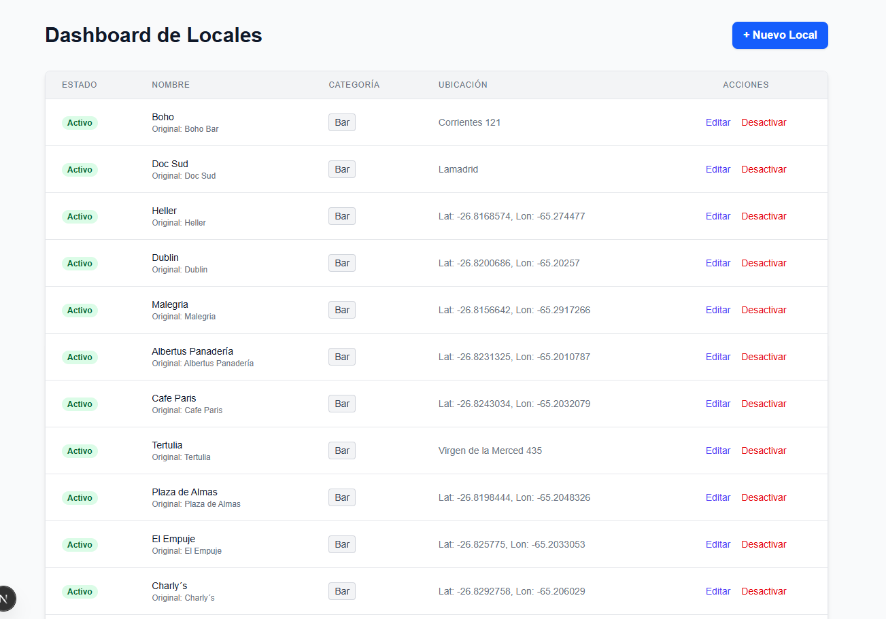
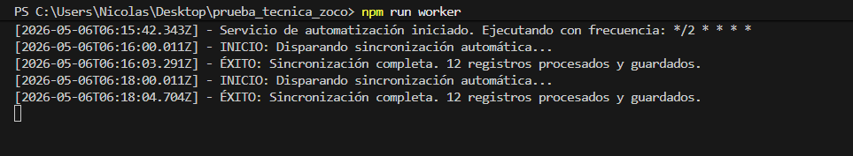
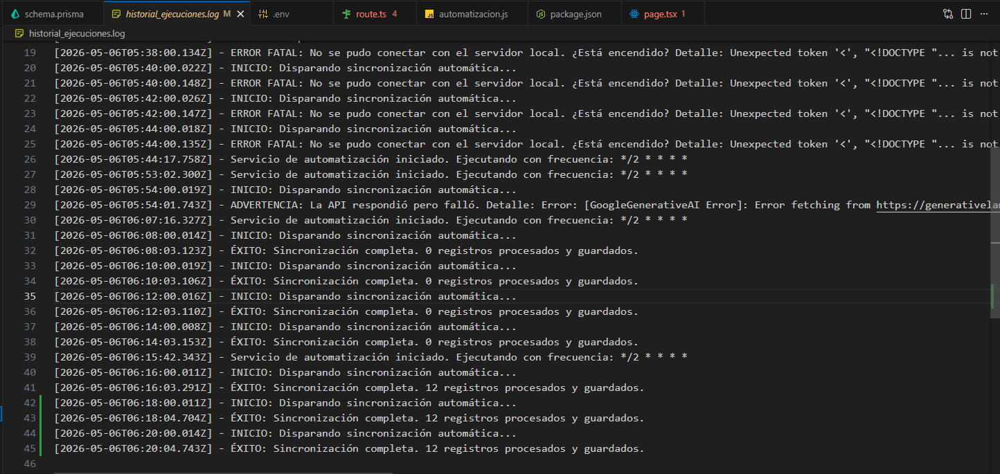

# Sincronizador Automatizado de Locales

Este proyecto es una solución integral para obtener, procesar, normalizar y administrar datos de bares y pubs en Tucumán. Utiliza la API de Overpass, Inteligencia Artificial (Gemini) para la limpieza de datos, y presenta un Dashboard interactivo construido con Next.js y Tailwind CSS.

## 🚀 Tecnologías Utilizadas
- **Frontend / Backend:** Next.js (App Router), React, Tailwind CSS.
- **Base de Datos:** PostgreSQL (Neon) + Prisma ORM.
- **Automatización:** `node-cron` para ejecución programada.
- **Inteligencia Artificial:** Google Gemini (`gemini-pro`) para limpieza y normalización.
- **Fuente de Datos:** Overpass API (OpenStreetMap).

---

## 📸 Evidencias de Ejecución (Entregables)

*(Nota: Aquí se encuentran las capturas que demuestran el funcionamiento de las automatizaciones y el CRUD).*

- **Dashboard Visual (CRUD):**
  

- **Worker de Automatización ejecutándose:**
  

- **Logs del Historial de Ejecuciones:**
  

---

## 🧠 Parte 5: Criterio Técnico (Respuestas)

### 1. ¿Cómo evitás duplicados?
Para evitar duplicados utilicé un enfoque a nivel de Base de Datos apoyado por IA. Primero, la IA normaliza los nombres (ej. "Boho Bar" pasa a ser "Boho"). Luego, en Prisma configuré una clave única compuesta `@@unique([normalizedName, location])`. 
Al guardar los datos, utilizo la función `upsert` de Prisma: si la combinación de Nombre Normalizado + Ubicación ya existe, simplemente actualiza la fecha de modificación (`updatedAt`); si no existe, crea un nuevo registro.

### 2. ¿Cómo escalarías este sistema?
Si el volumen de datos creciera a miles de registros por ciudad:
1. **Desacoplar el Cron:** Movería el script de `node-cron` a un servicio en la nube especializado (como AWS EventBridge + Lambda o GitHub Actions) para no saturar el servidor principal.
2. **Colas de mensajes:** Implementaría un sistema como BullMQ o RabbitMQ. Al traer miles de datos de la API, los encolaría para enviarlos a la IA en lotes pequeños (batches), evitando errores de *Rate Limit* y *Timeouts*.
3. **Paginación:** En el frontend, implementaría paginación o *Infinite Scroll* en el Dashboard para no sobrecargar el renderizado inicial.

### 3. ¿Qué problemas puede tener este flujo?
1. **Inconsistencia de la IA (Alucinaciones):** A veces la IA puede clasificar mal un local o devolver un JSON mal formateado si el prompt no es estricto. (Mitigado con bloque `try/catch` y *fallback* manual).
2. **Dependencia de la API de origen:** Overpass API puede caerse, cambiar sus cuotas o traer datos con formatos irregulares (ej. pines sin nombre de calle, solo con lat/lon).
3. **Límites de tiempo en Serverless:** Si el procesamiento con la IA tarda más de 10-15 segundos, plataformas como Vercel podrían cortar la ejecución de la ruta de la API (`504 Gateway Timeout`).

### 4. ¿Cómo mejorarías la calidad de los datos?
1. **Human-in-the-loop:** Precisamente lo que implementé con el **Dashboard**. Por más buena que sea la IA, siempre debe haber un panel donde un administrador pueda editar y corregir las coordenadas geográficas feas o nombres extraños (CRUD).
2. **Validación Cruzada (Cross-referencing):** Tomaría el nombre extraído de Overpass y lo buscaría automáticamente en la **Google Places API** para enriquecerlo con fotos, reseñas y horarios de apertura reales.

---

## 🛠️ Instrucciones de Instalación

1. Clonar el repositorio.
2. Instalar dependencias:
   \`\`\`bash
   npm install
   \`\`\`
3. Configurar variables de entorno en un archivo \`.env\`:
   \`\`\`env
   DATABASE_URL="postgres://..."
   GEMINI_API_KEY="AIzaSy..."
   \`\`\`
4. Sincronizar la base de datos:
   \`\`\`bash
   npx prisma generate
   npx prisma db push
   \`\`\`
5. Iniciar el servidor web:
   \`\`\`bash
   npm run dev
   \`\`\`
6. (Opcional) Iniciar el worker de automatización en otra terminal:
   \`\`\`bash
   npm run worker
   \`\`\`